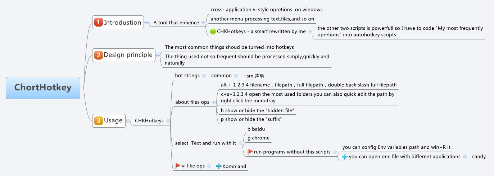

# ChortHotkey - a smart tools in windows
## What is ChortHotkey?

A tool that enhance oprations on windows

 **CHKHotkeys**:a smart tools rewritten by me(some scripts were collected,and i rewrited them)

## 什么是ChortHotkey
Chorthotkey是一个我使用AUTOHOTKEY很长世间以后认为的非常适合Windows习惯的一套脚本，我收集了一些脚本，然后根据自己的需要重写了一些，自己编写了一些，虽然不多，但基本上暂时足够我使用，其他的东西我就教给Candy和Vimdektop来。

## Design principle

**Balance Efficience and Simplity**
**Efficience** -- The most common things shoud be turned into hotkeys
**Simplity** -- The thing used not so frequent should be processed simply,quickly and naturally

## 设计准则

平衡效率和简洁
效率 - 特别常用的东西应该被设置成快捷键
简介 - 常用的东西不必要设置成快捷键，但是要足够简单的启动

## Usage

## 用法（如上）

PS：有部分源码中出现的Sysconfig是我的快捷方式所在地（已配置Path变量）

[参考我之前的Blog](http://twocucao.xyz/2015/02/22/Chorthotkey%E5%8F%91%E5%B8%83/)

## ChangeLog
Add some autohotkey from others 

1. candy --  a powerful menu that can process long text or short,specific files with specific application,and so on.
2. vimdesktop -- windows all in vi-style
3. Chorthotkey -- a script  written or searched online and modified  by me.

## licence
candy -- GPLv3   https://github.com/victorwoo/vimdesktop
vimdesktop -- MIT   https://github.com/aamii/Candy
chorthotkey -- MIT

